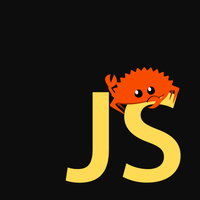

<p align="center">
  
</p>

# Rustype 🦀

Type-safe variant, result and vector straight (well, almost) from Rust language.  Helps to cope with situations where, for example, a value may be missing - we have a stylish API, no more boring code like `if stuff == null {...} else {...}` 


## Install

Using npm

```sh
npm i @faramo.zayw/rustype
```

Using yarn

```sh
yarn add @faramo.zayw/rustype
```

## Supporting IE11 and obsolete platforms

This library uses features like destructuring assignment, `for..of` and `const/let` declarations and doesn't ship with ES5 transpiled sources. If you aim to support browsers like IE11 and below → make sure you run Babel over your `node_modules`

## Usage

### `Option<T>`

```ts
import { Option } from "@faramo.zayw/rustype";

interface User {
	id: number;
	firstName: string;
	lastName: string;
	email?: string;
	phone?: string;
	age: number;
}

const defaultUser: User = { ... };
const fetchUser = (userID: number): Option<User> => { ... };

const myUser = fetchUser(1297)
	.map(({ firstName, lastName, ...props }) => ({
		username: `@${firstName}_${lastName}`,
		...props,
	}))
	.filter(({ age }) => age > 18)
	.unwrapOr({ ...defaultUser });
```

### `Result<T, E>`

```ts
import { Result, Err, Ok } from "@faramo.zayw/rustype";

const safeAdd = (a: number, b: number): Result<number, string> => {
	if (Number.isSafeInteger(a) && Number.isSafeInteger(b)) {
		const sum = a + b;
		return Number.isSafeInteger(sum)
			? Ok(sum)
			: Err("The sum result is not a safe integer.");
	}

	return Err("Some of the arguments are not safe integers.");
};

console.log(safeAdd(6, 7)); // Ok(13)
console.log(safeAdd(Infinity, 7)); // Err("Some of the arguments are not safe integers.")
console.log(safeAdd(Number.MAX_SAFE_INTEGER - 1, 7)); // Err("The sum result is not a safe integer.");
```

### `Vector<T>`

```ts
import { Vector } from "@faramo.zayw/rustype";

const vec = new Vec(1, 2, 3, 4, 5, 6, 7, 8, 12)
	.repeat(3)
	.map(item => item % 2 * Math.random())
	.rotateLeft(5)
	.partition((item) => item % 2 === 0)
```

### API Docs

You can see the documentation [here](https://rustype.vercel.app/).

### Alternatives?

- [monads](https://github.com/hqoss/monads) - «Type safe Option, Result, and Either types; inspired by Rust.»
- [rusted](https://github.com/pocka/rusted) - «[Rust](https://github.com/rust-lang/rust)'s syntax features for javascript.»
- [@pacote/option](https://www.npmjs.com/package/@pacote/option) - «[Option](https://doc.rust-lang.org/std/option/enum.Option.html) type inspired by Rust.»
- [ReScript](https://rescript-lang.org/) - «The JavaScript-like language you have been waiting for.»

### License

MIT
